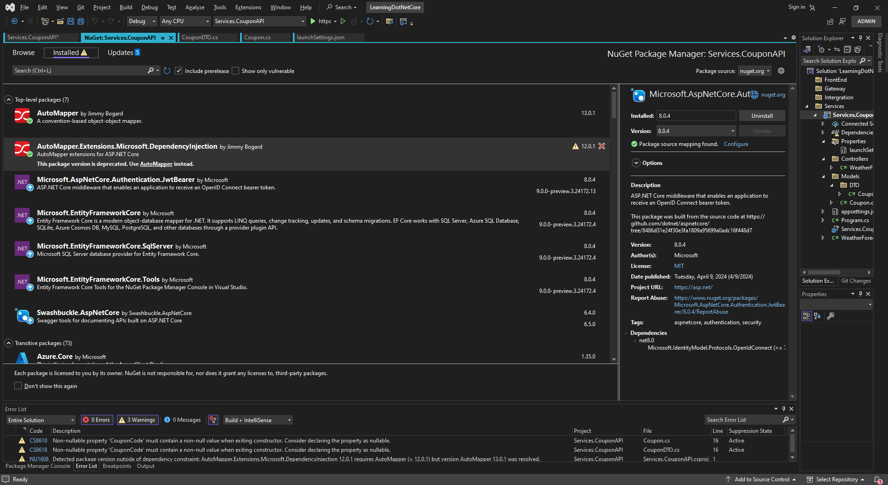

### NOTE cho project COUPONAPI
1. Có thể thay đổi port mạng https hoặc http bằng cách sửa trong file config

2. Có thể đổi màu tab của trên visual studio theo màu của từng project riêng lẻ

## Nugget using
1. AutoMapper
2. AutoMapper.DependencyInjection (nếu ver của AutoMapper là 13 thì không  cần cái này: Reference link: https://stackoverflow.com/questions/78025475/asp-net-core-automapper-how-to-resolve-errorcs0121-the-call-is-ambiguous-betwe)
3. Microsoft.EntityFrameworkCore
4. Microsoft.EntityFrameworkCore.SqlServer
5. Microsoft.EntityFrameworkCore.Tools
6. Microsoft.AspNetCore.Authentication.JwtBearer

Detail in image as below:

## Package Manager Console
Theo như mình đang hiểu ở đây, thì nó đang là một cái command prompt cho phép người dùng thực hiện lệnh để tạo ra các migration để đưa data dô database. Các file này sẽ được store trong folder Migrations hình như được gen automatically luôn.
